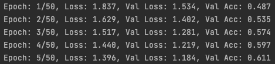
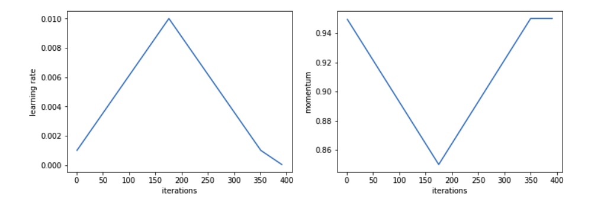

# Neural Networks from Scratch
***

The goal is to build a Python package providing the necessary functionality for 
training Neural Network models from scratch. No Tensorflow or Pytorch. Just 
old-fashioned Python and its computing library, Numpy.

If you have any comments, questions, or concerns, I would love to hear from you \
(e: mlnasell@uwaterloo.ca).

## Installation
***
To install this package:
1. Run `git clone https://github.com/MichaelNasello/nnFromScratch.git`
2. Move to code directory with `cd nnFromScratch`
3. Run `python setup.py install`

## Demo
***
To see the package in action, navigate to the `demo` folder and run a program. 
Here various problems are solved using Neural Networks built using code written in this
repository. 

The program `dense_network.py` trains a Dense (or Fully Connected) model on the mnist 
dataset. 

Below is the output for the first 5 epochs of training:

Validation accuracy is increasing, and the model is clearly learning!

## How it works
***

### A Learnable Parameter 
The backbone of this library is the `Variable` class in `nn/variable.py`. Here a 
learnable parameter of a model can be instantiated. Among other things, a `Variable`
will store a parameter's value and gradient.

### Layers
Now that we can handle create model parameters, it is the natural next step to build 
up more meaningful Neural Network layers. Some layers, such as `Dense`, `Conv2D`, `ReLU`,
and `Dropout`, are defined in `nn/layers.py`. I plan on appending to this list.

Layers are essentially responsible for two things: the *forward pass*, and the *backward
pass*. The *forward pass* simply takes an input `x`, performs some operation `f`, and 
feeds some output `f(x)` to the next layer. The *backward pass* is much more involved.
It is responsible for propagating error throughout layers and computing parameter gradients
necessary for training the model.

### Models
To provide some high-level functionality, a list of layers can be feed to a `Model`, 
defined in `nn/model.py`. This class provides the ability to perform a variety of tasks,
including a full *forward pass*, *backward pass*, *training session*, *prediction session*, 
*model save*, and *model load*.

One notable feature of the `Model` class is its `fit_one_cyle` method. Unlike typical training
functions, this one does not use a constant learning rate or momentum value. Following Leslie
Smiths work on cyclical hyper-parameters (https://arxiv.org/pdf/1506.01186.pdf), convergence is
accelerated when learning rates and momentum follow a similar pattern of that shown below.

The `HyperParamScheduler`, found in `nn/scheduler.py`, can be used to feed cyclical 
hyper-parameter values to the optimizer.

### Optimizers
The optimizer is where the magic happens! During a *training session*, a *backward pass* of the
model is executed, and the gradients of all model parameters are computed. The optimizer is 
responsible for updating parameter values with these gradients. Currently, two optimizers are
defined: `SGD` and `Adam`. These implementations can be found at `nn/optimizers.py`. Several 
techniques are used to accelerate/improve the convergence of the model, including *weight decay*,
*momentum*, exponentially weighted moving averages of gradients, etc. 

